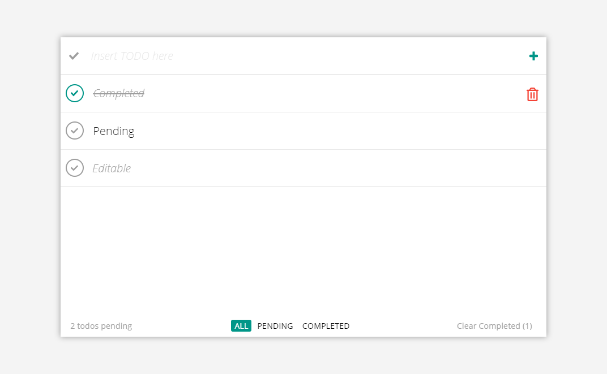

# TODO, para Sancrisoft, por Victor Requena.

## Introducción a la interfaz y funcionalidad
En la cabecera de la aplicación se encuentra una caja de texto (esta es la entrada de texto para las tareas); a la izquierda de la caja de texto, se encuentra un botón, cuya funcionalidad es marcar o desmarcar todas las tareas pendientes. A la derecha de la caja de texto, se encuentra un botón, cuya funcionalidad es agregar una tarea a la lista, cuyo texto va a ser el introducido en la caja de texto.

Bajo la cabecera, se encuentra la sección principal de la aplicación; en esta se muestra la lista de tareas. Cada una de estas tareas cuenta con un botón que permite marcar y desmarcar la tarea, y un botón para eliminar la tarea (este aparece cuando posicionamos el mouse sobre la tarea).

Cuando una tarea ha sido completada, el texto se verá en un tono más claro, inclinado y con una línea a través.
Las tareas también pueden ser editadas. Cuando están en modo de edición el texto se verá en un tono más claro e inclinado.

En la esquina inferior izquierda, se encuentra un contador de tareas pendientes. En el centro se encuentran tres filtros, con los cuales podemos seleccionar qué tareas ver; estas son: **_Todas_**, **_Pendientes_**, y **_Completadas_**. Además, en la esquina inferior derecha, se encuentra un botón, cuya funcionalidad es borrar todas las tareas que ya han sido realizadas.

## Instrucciones básicas de uso
Las instrucciones indicadas, aplican para todo tipo de dispositivos.

* Luego de clonar el repositorio: `cd sancrisoft-todo && npm start`.
* Para crear una tarea, basta con escribirla y presionar enter, o alternativamente presionar el botón a la derecha de la caja de texto.
* Para marcar o desmarcar una tarea, debe presionarse el botón posicionado a la izquierda de la tarea.
* Para marcar o desmarcar todas las tareas, se debe presionar el botón posicionado a la izquierda de la caja de texto.
* Para editar una tarea, debe hacerse doble click (o doble pulsación en una pantalla táctil). Esto permitirá modificar el texto de la tarea. Luego de escribir el nuevo contenido de la tarea, debe presionarse enter para guardar los cambios. Si accidentalmente de deja el campo vacío, ningún cambio será realizado.
* Para borrar una tarea, se debe posicionar el mouse sobre esta misma, y luego presionar el botón con el basurero (en dispositivos móviles, este botón está siempre presente).
* Para eliminar todas las tareas que ya han sido completadas, puede presionarse el botón posicionado en la esquina inferior derecha.
* Para filtrar las tareas, puede presionarse cualquiera de los tres filtros posicionados en la parte inferior de la aplicación.

## Descripción técnica
La aplicación fue construida con React y Redux, implementando el patrón de componentes posicionales y componentes contenedores. Ningún componente cuenta con estado independiente. El tiempo de construcción fue de 3 días y el tiempo de capacitación fue de 4 días.

## Autor
**Victor Requena**, aplicando por el puesto de desarrollador junior React/NodeJS, **2018**.
